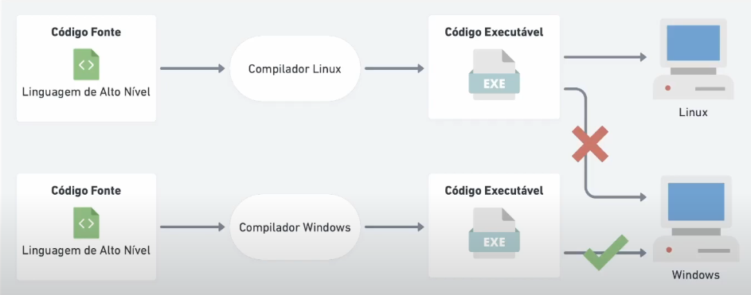
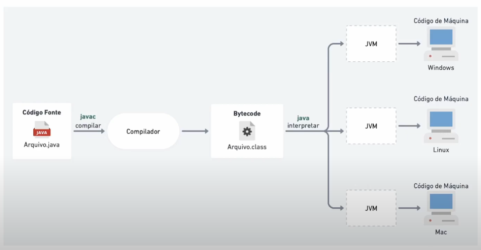
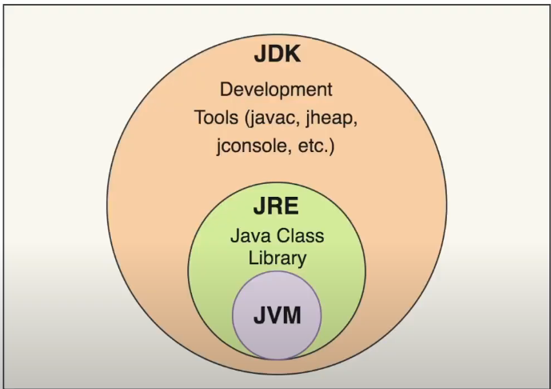
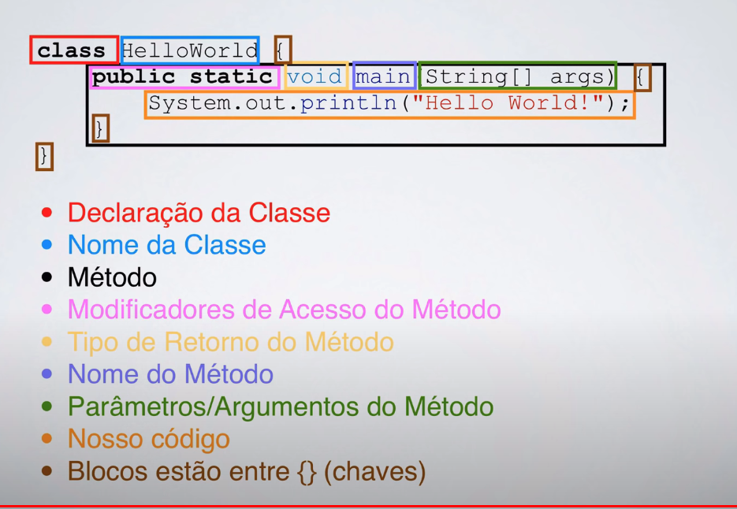
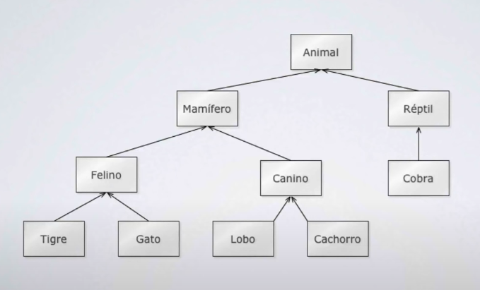
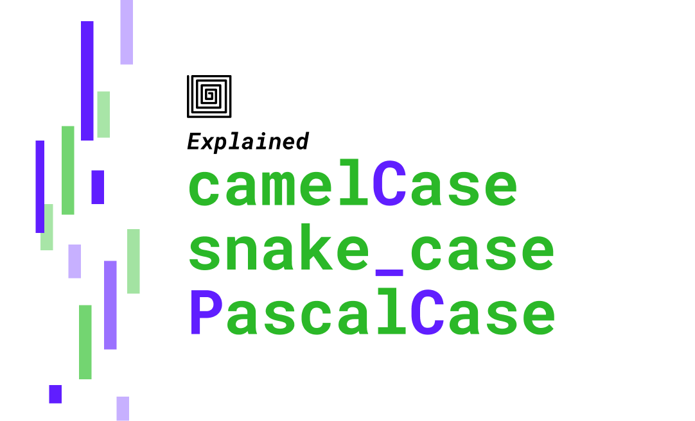

## POO Anotações

##### Próxima video aula: 
[Curso de Java 34 - Orientação a Objetos: Variáveis e metodos estáticos (modificador static)](https://www.youtube.com/watch?v=Dz_w4YpFL80&list=PLGxZ4Rq3BOBq0KXHsp5J3PxyFaBIXVs3r&index=65)
> Tempo: 00:00
##### Referências:

-   [Curso de Java Básico gratuito](https://youtube.com/playlist?list=PLGxZ4Rq3BOBq0KXHsp5J3PxyFaBIXVs3r&si=kR03_n1LTnHH2wzU)
- [Ascii](https://www.asciitable.com/)
- [Entenda o que é WORA, JVM, JDK e JRE! - Ep. 1](https://www.youtube.com/watch?v=U6Gh6HYyl6c)
---
##### Problemática, e como o java se tornou multiplataforma?
A linguagem de alto nível para poder ser entendida pelo computador necessita ser traduzida por meio do compilador para o computador.  
**Fluxo**:  

Seguindo esse fluxo percebe-se que teriamos que ter uma versão do mesmo programa para cada sistema operacional, que é o que normalmente acontece, temos a versão para windows, linux, macos, etc...  
Pensando neste problema e visando a portabilidade/multiplataforma, os desenvolvedores do java decidiram fazer as coisas de uma forma diferente.

> **WORA**: Write Once Run All
2 coisas novas foram adicionadas:
* O compilador agora gera em vez de gerar um código executável, ele gera bytecode com extensão .class que é entendido pela jvm.
* Jvm: se tornou responsável por fazer a tradução do código de acordo com as especificidades de cada máquina. 

#### JVM VS JDK VS JRE
* **JVM** ->  **Tradutor** responsável por transformar o bytecode em código executável/binário.
* **JRE** ->  Ambiente de execução do java onde você vai ter todas as bibliotecas padrões do java que serão utilizadas.
    * A JRE provê os requisitos mínimos para executar um programa java. Ele contém uma JVM, os pacotes básicos do Java (API core), por exemplo o pacote lang que tem a classe String.  
    Por fim o JRE também provê ferramentas para executar os programas java. Uma delas é o executável java.exe, que é utilizado para executar uma classe java que contém um método main(String args[]).  
    Agora você já sabe que quando você executa o comando java SuaClasse, é o JRE que provê esse programa java.exe que você está usando.
* **JDK** ->  Ambiente de desenvolvimento Java.




##### Identificando elementos no código.


##### Paradigmas

-   Programação estruturada
-   Programação Orientada a Objetos

##### Vantagens de se usar POO

-   Reuso do código
-   Reflete o mundo real
-   Manutenção mais fácil

### Conceitos POO

##### Pacotes
Formas de organizar as pastas
Convenção:

> dominio + projeto + pasta
> ex: com.zig.poo.aula1

---

-   **Classes**:
    - Descrição de um ou mais objetos/algo.
    - Uma classe contém: - Nome da classe - Conjunto de atributos (descrição) - Conjunto de métodos (comportamento/ações)
-   **Herança**:
    - Permite reutilização de estrutura e comportamento de uma classe.
    - Ex:
    
-   **Polimorfismo**:
    - Geralmente relacionado a métodos.
    - Seguindo o exemplo acima dos animais, todos emitem sons, entretanto cada espécie tem sua forma de emitir um som, ex: o gato **mia**, o cachorro **late**, a vaca **berra**, etc...
    Percebe-se que temos um padrão em relacão as ações/métodos mas que apenas o valor ou até a forma que é implementada é alterada.

### Syntax Java

> **Obs**: favor não esquecer o **ponto e virgula ;**
> Utiliza-se o **camelCase** entretanto para criação de classes e de objetos utilizasse o **PascalCase**;
> 

#### Como declarar uma variável?
`<tipo> <nome da variavel>`
`<tipo> <nome da variavel> = <valor>`

```java
String nome;
String nome = "Jorge";
```

#### Tipos Primitivos
Ocupam menos espaço, tem valores fixos do quanto eles irão ocupar na memória.
Basicamente você tem os tipos primitivos dividos em 2 categorias:

-   **booleans (verdadeiro/falso)**
-   **numbers (números)**
    Os números são divididos em 2 categorias também:
    - **inteiros** 
        - **byte**: 8 bits // -128 a 127 - **short**: 16 bits // -32.768 a 32.767 
        - **int**: 32 bits // -2.147.483.648 a 2.147.483.647 
        - **long**: 64 bits // número pra kct
        - **char**: caracter
    - **pontos flutuantes** (vírgula)
        - **float**: 32 bits
        - **double**: 64 bits

##### Representando bases em java
É possível separar os números com o "_", de forma que fique mais legível.
> Obs: Existem algumas regras na utilização do underscore, ou seja, preste atencão e olhe a documentação depois. 
```java
double legivel = 123_456_789_10
```
* Decimal
```java
int decimal = 12
```
* Hexademal
> Deve-se iniciar o valor com "0x" para indetificar esse valor como hexadecimal.
```java
int hexadecimal = 0x1ff
```
* Octal
> Deve-se iniciar o valor com "0" para indetificar esse valor como Octal.
```java
int octal = 032
```
* binário
> Deve-se iniciar o valor com "0b" para indetificar esse valor como Binário.
```java
int binario = 0b11010
```

##### Escapes em java
* **\t** : tab
* **\b** : backspace
* **\n** : nova linha
* \ \ : barra invertida
* **\ddd**: constante octal 
* **\uxxxx** : constante hexadecimal 

##### Lendo variáveis
> Lembrar de importar a classe Scanner
```java
// Instanciando
Scanner scan = new Scanner(System.in);
// Lendo uma linha inteira;
String nome = scan.nextLine();
// Lendo um tipo especifico;
int age = scan.nextInt();
double height = scan.nextDouble();     
```    

#### Operadores lógicos e relacionais
Pré e pós incremento/decremento
```java
int number = 0;
// incrementa após mostrar a variável
// output: 0
System.out.println(number++);
// incrementa antes de mostrar a variável
// output: 2
System.out.println(++number);
```
* **a & b**: e
* **a | b**: ou
* **a ^ b**: se e somente se

##### while vs do while
```java
// white
int count = 10;
while(count != 0) {
    System.out.println("Contagem regressiva: %d", count)
    count--
}
int count = 10;
// do while
do {
    // realiza primeiro o bloco de código e depois verifica se atende as condições.
    System.out.println("Contagem regressiva: %d", count)
    count--
} while(count != 0);
```

#### Vetores e Matrizes
```java
// Vetores
double[] marks = new double[5]
double marks[] = ['H','e','l','l','o']
// Matrizes
// [linhas][colunas]
double[][] marks = new double[4][2]
double[][] marks = { {7,8,9,10}, {9,9,9,10} }
```
#### FINALMENTE POO
> Pulei a parte de classes, atributos e métodos...

##### Construtores
```java
// não passar nenhum construtor seria equivalente a isso
carro() {}
// combinando construtores
carro() {}
carro(String marca, String cor) {
    this.marca = marca;
    this.cor = cor;
}
```
##### Modificadores
* **Public**: Todos conseguem ver/acessar os métodos e atributos de uma classe;
* **Private**: Apenas a própria classe pode ver/acessar os métodos e atributos de uma classe;
* **Protected**: Classes que estão no mesmo pacote podem ver/acessar os métodos e atributos de uma classe;

##### SOBRECARGA ( OVERLOAD )
* **Construtores**
```java
carro() {}
carro(String marca, String cor) {
    this.marca = marca;
    this.cor = cor;
} 
```
* **Métodos**
```java
public int soma(int num1, int num2) {
    return num1 + num2;
}
public double soma(double num1, double num2) {
    return num1 + num2;
}
public double soma(double[] vetorDouble) {
    double total = 0;
    for (int index = 0; index < vetorDouble.length; index++) {
        total += vetorDouble[index];
    };
    return total;
}
```