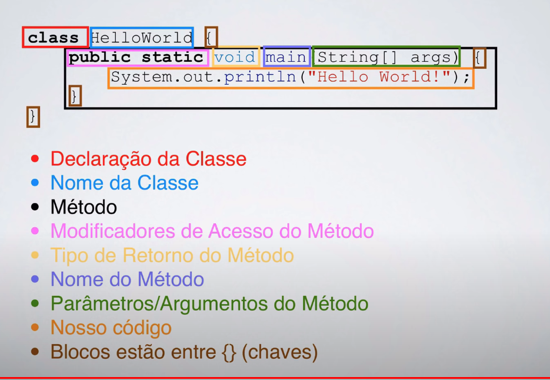
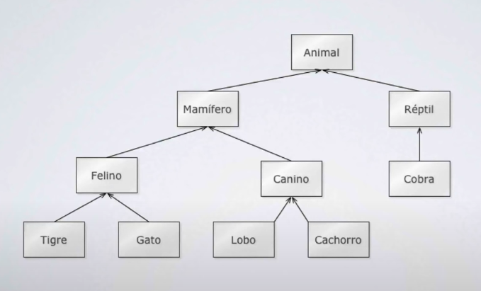
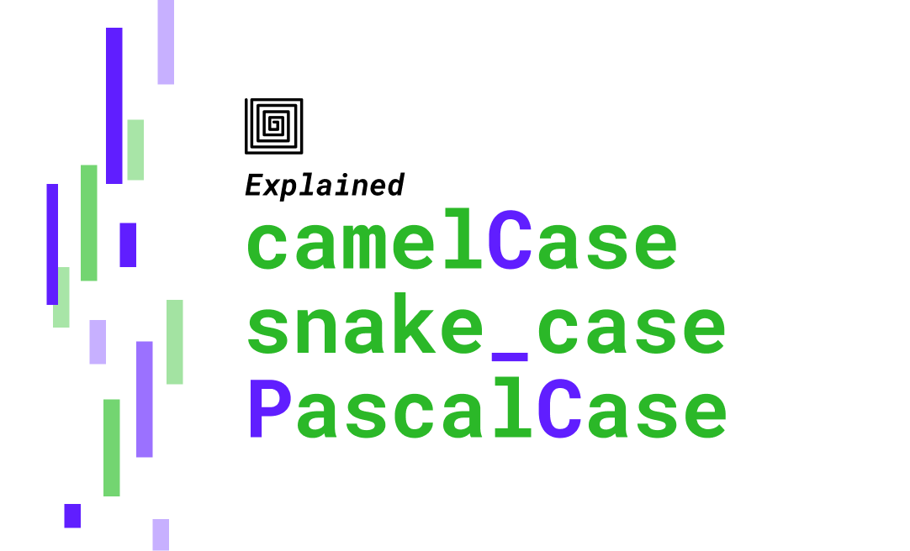

## POO Anotações

##### Referências:

-   [Curso de Java Básico gratuito](https://youtube.com/playlist?list=PLGxZ4Rq3BOBq0KXHsp5J3PxyFaBIXVs3r&si=kR03_n1LTnHH2wzU)
- [Ascii](https://www.asciitable.com/)
---

##### Identificando elementos no código.


##### Paradigmas

-   Programação estruturada
-   Programação Orientada a Objetos

##### Vantagens de se usar POO

-   Reuso do código
-   Reflete o mundo real
-   Manutenção mais fácil

### Conceitos POO

**Pacotes**
Formas de organizar as pastas
Convenção:

> dominio + projeto + pasta
ex: com.zig.poo.aula1

---

-   **Classes**:
    Descrição de um ou mais objetos/algo.
    Uma classe contém: - Nome da classe - Conjunto de atributos (descrição) - Conjunto de métodos (comportamento/ações)
-   **Herança**:
    Permite reutilização de estrutura e comportamento de uma classe. Ex:
    
-   **Polimorfismo**:
    Geralmente relacionado a métodos.
    Seguindo o exemplo acima dos animais, todos emitem sons, entretanto cada espécie tem sua forma de emitir um som, ex: o gato **mia**, o cachorro **late**, a vaca **berra**, etc...
    Percebe-se que temos um padrão em relacão as ações/métodos mas que apenas o valor ou até a forma que é implementada é alterada.

#### Syntax Java

> **Obs**: favor não esquecer o **ponto e virgula ;**
> utilizase o **camelCase** entretanto para criação de classes e de objetos utilizasse o **PascalCase**;
> 

##### Como declarar uma variável?
`<tipo> <nome da variavel>`
`<tipo> <nome da variavel> = <valor>`

```java
String nome;
String nome = "Jorge";
```

##### Tipos Primitivos
Ocupam menos espaço, tem valores fixos do quanto eles irão ocupar na memória.
Basicamente você tem os tipos primitivos dividos em 2 categorias:

-   **booleans (verdadeiro/falso)**
-   **numbers (números)**
    Os números são divididos em 2 categorias também:
    - **Inteiros** 
    - **byte**: 8 bits // -128 a 127 - **short**: 16 bits // -32.768 a 32.767 
    - **int**: 32 bits // -2.147.483.648 a 2.147.483.647 
    - **long**: 64 bits // número pra kct - **char**: caracter
        -   **Pontos flutuantes** (vírgula)
            -   **float**: 32 bits
            -   **double**: 64 bits

##### Representando bases em java
É possível separar os números com o "_", de forma que fique mais legível.
> Obs: Existem algumas regras na utilização do underscore, ou seja, preste atencão e olhe a documentação depois. 
```java
double legivel = 123_456_789_10
```
* Decimal
```java
int decimal = 12
```
* Hexademal
> Deve-se iniciar o valor com "0x" para indetificar esse valor como hexadecimal.
```java
int hexadecimal = 0x1ff
```
* Octal
> Deve-se iniciar o valor com "0" para indetificar esse valor como Octal.
```java
int octal = 032
```
* binário
> Deve-se iniciar o valor com "0b" para indetificar esse valor como Binário.
```java
int binario = 0b11010
```

##### Escapes em java
* **\t** : tab
* **\b** : backspace
* **\n** : nova linha
* \ \ : barra invertida
* **\ddd**: constante octal 
* **\uxxxx** : constante hexadecimal 